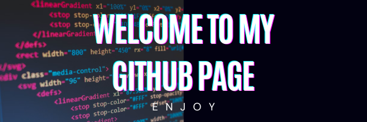

  
   

## 😃 About Me:
Hi there I'm Matteo, a computer science student at the University of Salerno. Here, you can find some of the projects I've worked on or I'm currently working on. Primarily, I've been involved in developing websites, handling backend tasks with Java/Python and crafting frontend elements with HTML, JavaScript, CSS and TailwindCSS.

## 🌐 Socials:
     

## 💻 Tech Skill:
                

## 📊 GitHub Stats:
 

  
   
  

 

## 🔝 Top Contributed Repo
 

  
   

<!-- Proudly created with GPRM ( https://gprm.itsvg.in ) -->
